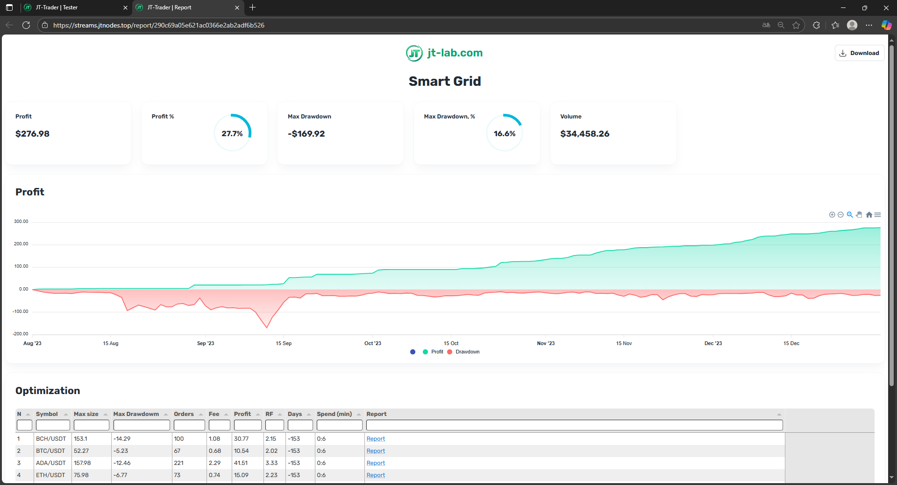

# JT-Trader: Полный обзор платформы для алгоритмической торговли

[GitHub](https://github.com/jt-lab) | [Документация](https://docs.jt-lab.com) | [JT-Lib](https://github.com/jt-lab/jt-lib)

## Что такое JT-Trader?

**JT-Trader** - это профессиональная платформа с открытым исходным кодом для алгоритмической торговли криптовалютами. Платформа объединяет в себе мощный движок для выполнения торговых алгоритмов, комплексную систему тестирования стратегий и интуитивный веб-интерфейс для управления торговыми операциями.

JT-Trader построена на основе библиотеки JT-Lib и предоставляет полноценную экосистему для создания, тестирования и запуска торговых роботов на различных криптобиржах. Платформа позволяет как разработчикам создавать сложные торговые стратегии, так и трейдерам использовать готовые решения для автоматизации торговли.

## Создание торговых роботов

### Как работает процесс создания робота

Создание торгового робота в JT-Trader начинается с определения торговой стратегии - вы решаете, при каких условиях робот должен входить в позицию, когда закрывать её и как управлять рисками. Затем вся логика записывается в виде класса `Script` на TypeScript, который наследуется от `BaseScript` и содержит методы для инициализации, обработки рыночных данных, управления ордерами и очистки ресурсов. Стратегия настраивается через пользовательские параметры, определяемые в `static definedArgs` - это могут быть размер позиции, проценты стоп-лоссов и тейк-профитов, периоды индикаторов, цены входа и выхода, а также любые другие настройки, которые можно изменять без переписывания кода. Перед запуском в реальной торговле стратегия обязательно тестируется на исторических данных через встроенный тестер, что позволяет оценить производительность, найти оптимальные параметры и выявить потенциальные проблемы. После успешного тестирования робот запускается в режиме реального времени через веб-интерфейс JT-Trader, где можно мониторить его работу и при необходимости корректировать параметры прямо во время торговли.

### Жизненный цикл торгового робота

Каждый робот проходит через четко определенные этапы:

- **Инициализация** (`onInit()`) - настройка индикаторов, подключение к биржам, загрузка параметров
- **Обработка данных** (`onTick()`) - анализ рыночных данных и принятие торговых решений
- **Управление ордерами** (`onOrderChange()`) - реакция на изменения статуса ордеров
- **Завершение** (`onStop()`) - очистка ресурсов и закрытие позиций

### Пример простого торгового робота

Вот как выглядит RSI стратегия с автоматическими стоп-лоссами и тейк-профитами:

```typescript
class Script extends BaseScript {
  static definedArgs = [ // Пользовательские параметры стратегии
    { key: 'symbols', defaultValue: 'BTC/USDT:USDT' }, // Торговая пара
    { key: 'sizeUsd', defaultValue: 100 }, // Размер позиции в USD
    { key: 'slPercent', defaultValue: 2 }, // Процент стоп-лосса
    { key: 'tpPercent', defaultValue: 4 } // Процент тейк-профита
  ];

  private basket: OrdersBasket; // Менеджер ордеров
  private rsi: RelativeStrengthIndex; // RSI индикатор
  private sizeUsd: number;
  private slPercent: number;
  private tpPercent: number;

  async onInit() { // Инициализация при запуске
    this.sizeUsd = getArgNumber('sizeUsd', 100); // Загружаем параметры
    this.slPercent = getArgNumber('slPercent', 2);
    this.tpPercent = getArgNumber('tpPercent', 4);

    this.basket = new OrdersBasket({ // Создаем менеджер ордеров
      symbol: this.symbols[0],
      connectionName: this.connectionName
    });
    await this.basket.init();

    this.rsi = await globals.indicators.rsi(this.symbols[0], '1h', 14); // Инициализируем RSI
  }

  private async signal(): Promise<number> { // Логика торговых сигналов
    const longPosition = await this.basket.getPositionBySide('long');
    if (longPosition.contracts !== 0) return 0; // Если уже есть позиция - не торгуем
    
    const rsiValue = this.rsi.getValue();
    if (rsiValue < 30) return 1; // RSI < 30 - сигнал на покупку
    if (rsiValue > 70) return -1; // RSI > 70 - сигнал на продажу
    return 0; // Нет сигнала
  }

  async onTick() { // Вызывается на каждом тике цены
    const currentPrice = close(); // Текущая цена закрытия
    const signalValue = await this.signal();
    
    if (signalValue === 1) { // Сигнал на покупку
      const contracts = this.basket.getContractsAmount(this.sizeUsd, currentPrice); // Конвертируем USD в контракты
      const stopLoss = currentPrice * (1 - this.slPercent / 100); // Цена стоп-лосса
      const takeProfit = currentPrice * (1 + this.tpPercent / 100); // Цена тейк-профита
      await this.basket.buyMarket(contracts, takeProfit, stopLoss); // Покупаем с автоматическими стопами
    }
    
    if (signalValue === -1) { // Сигнал на продажу
      const longPosition = await this.basket.getPositionBySide('long');
      if (longPosition.contracts > 0) { // Если есть длинная позиция
        const contracts = longPosition.contracts;
        const stopLoss = currentPrice * (1 + this.slPercent / 100); // Стоп-лосс для шорта
        const takeProfit = currentPrice * (1 - this.tpPercent / 100); // Тейк-профит для шорта
        await this.basket.sellMarket(contracts, takeProfit, stopLoss); // Продаем с автоматическими стопами
      }
    }
  }

  async onOrderChange(order: Order) { // Обработка изменений ордеров
    if (order.status === 'closed') { // Если ордер исполнен
      log('Script', 'Ордер исполнен', { orderId: order.id, side: order.side }, true); // Логируем событие
    }
  }

  async onStop() { // Очистка при остановке
    await this.basket.cancelAllOrders(); // Отменяем все активные ордера
  }
}
```
## Тестирование стратегий на исторических данных


Тестирование на исторических данных - это критически важный этап разработки торговых стратегий, который позволяет оценить их эффективность до запуска в реальной торговле. В JT-Trader встроенный тестер загружает исторические данные с бирж, воспроизводит рыночные условия прошлых периодов и запускает вашу стратегию на этих данных, точно имитируя работу в реальном времени. Вы можете выбрать период тестирования, начальный баланс, торговые пары и временные рамки, а система автоматически учтет комиссии, спреды и проскальзывание для максимально реалистичных результатов. Тестер предоставляет детальную аналитику: общую прибыльность, максимальную просадку, коэффициент Шарпа, количество сделок, процент успешных операций и множество других метрик. Особенно ценна функция оптимизации параметров - тестер может автоматически перебрать тысячи комбинаций настроек стратегии и найти наиболее прибыльные конфигурации. Все результаты отображаются в виде графиков, таблиц и отчетов, что позволяет глубоко проанализировать поведение стратегии и принять обоснованное решение о её запуске в реальной торговле.

## Запуск роботов в реальном времени

Запуск торговых роботов в реальном времени осуществляется через веб-интерфейс JT-Trader в разделе Runtime, где вы создаете сценарий запуска, указывая файл со стратегией, подключение к бирже, торговые пары и пользовательские параметры. Система автоматически загружает код стратегии, инициализирует все необходимые компоненты и начинает получать рыночные данные в реальном времени через WebSocket соединения с биржами. Робот работает непрерывно, анализируя каждый новый тик цены и принимая торговые решения согласно заложенной в него логике, при этом все действия записываются в подробные логи с возможностью мониторинга через веб-интерфейс. Вы можете в любой момент остановить робота, изменить его параметры без перезапуска кода, просмотреть текущие позиции и ордера, а также получить детальную статистику производительности. Система обеспечивает надежную работу с автоматическим восстановлением после сбоев, мониторингом состояния соединений и защитой от критических ошибок, что позволяет роботам работать стабильно 24/7 без постоянного контроля.

## Мониторинг работы роботов

Мониторинг работы торговых роботов в JT-Trader осуществляется через встроенную систему отчетности JT-Lib, которая предоставляет готовые шаблоны отчетов для визуализации торговой активности и производительности стратегий. Система логирования записывает все действия роботов с детальной информацией о торговых операциях, изменениях параметров и системных событиях, при этом логи можно фильтровать по уровням важности и типам сообщений для быстрого поиска нужной информации. Встроенная система уведомлений об ошибках автоматически отслеживает критические события и проблемы в работе роботов, отправляя мгновенные оповещения при возникновении нештатных ситуаций. Особенно мощной возможностью является система debug в реальном времени, которая позволяет просматривать состояние всех объектов внутри скрипта - переменных, индикаторов, позиций, ордеров и других компонентов стратегии, что значительно упрощает отладку и оптимизацию торговых алгоритмов. Дополнительно доступны настраиваемые уведомления в Telegram, которые можно настроить для получения информации о важных событиях, изменениях в торговле или достижении определенных условий прямо на мобильное устройство, обеспечивая полный контроль над торговыми роботами даже вдали от компьютера.


