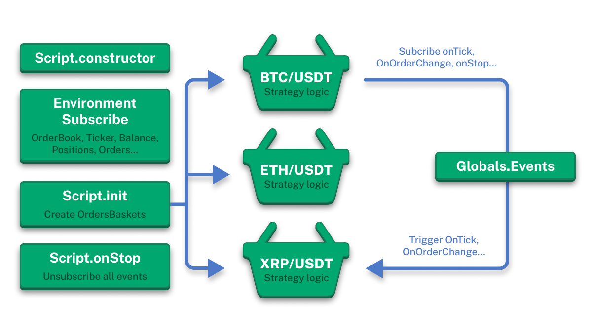

# Лучшие практики разработки скриптов



## Архитектура мультивалютных торговых ботов

Данный раздел описывает ключевые принципы создания эффективных и надежных торговых скриптов в JT-Lib, основанных на разделении ответственности между классами `Script` и `OrdersBasket`.

### Принцип разделения ответственности

Архитектура JT-Lib построена на четком разделении ролей между двумя основными компонентами:

**Класс Script** выполняет роль координатора и менеджера:
- Осуществляет общую настройку и конфигурацию торговой стратегии
- Определяет параметры для всех торговых пар (символов)
- Создает и управляет экземплярами `OrdersBasket` для каждого символа
- Осуществляет мониторинг и контроль над всеми активными корзинами
- Обрабатывает глобальные события и координирует работу между различными торговыми парами

**Класс OrdersBasket** реализует конкретную торговую логику:
- Содержит весь алгоритм и логику торговой стратегии для конкретного символа
- Подключается к бирже и управляет торговыми операциями для одной торговой пары
- Обрабатывает рыночные данные, ордера и позиции для своего символа
- Реализует специфическую торговую логику (grid, scalping, arbitrage и т.д.)
- Работает независимо от других корзин, обеспечивая изоляцию рисков

### Мультивалютная архитектура

Ключевое преимущество такой архитектуры заключается в возможности создания мультивалютных торговых ботов:

1. **Один Script - множество символов**: В рамках одного скрипта можно одновременно торговать на множестве торговых пар (BTC/USDT, ETH/USDT, XRP/USDT и т.д.)

2. **Независимые корзины**: Каждый `OrdersBasket` работает с одной торговой парой независимо от других, что означает:
   - Ошибка в одной корзине не влияет на работу других
   - Каждая корзина может иметь свои параметры и настройки
   - Возможность масштабирования - добавление новых торговых пар без изменения существующего кода

3. **Централизованное управление**: Script координирует работу всех корзин через глобальную систему событий, обеспечивая:
   - Единую точку конфигурации
   - Централизованную отчетность и мониторинг
   - Синхронизацию операций при необходимости

### Жизненный цикл торгового бота

Как показано на диаграмме выше, жизненный цикл включает следующие этапы:

1. **Script.constructor** - инициализация основного класса скрипта
2. **Environment Subscribe** - подписка на рыночные данные (OrderBook, Ticker, Balance, Positions, Orders)
3. **Script.init** - создание экземпляров OrdersBasket для каждого символа
4. **Script.onStop** - корректное завершение работы и отписка от всех событий

Каждый этап взаимодействует со всеми активными корзинами через систему событий, обеспечивая слабую связанность компонентов и высокую надежность системы.

Этот раздел содержит рекомендации и примеры для создания эффективных и надежных торговых скриптов в JT-Lib.

## Определение параметров скрипта

Используйте статическое свойство `definedArgs` для определения параметров скрипта с значениями по умолчанию:

```typescript
class Script extends BaseScript {
  // Определение параметров скрипта с значениями по умолчанию
  static definedArgs = [
    {
      key: 'symbols',
      defaultValue: 'BCH/USDT,BTC/USDT,ADA/USDT,ETH/USDT,XRP/USDT',
    },
    {
      key: 'sizeUsd',
      defaultValue: 100,
    },
    {
      key: 'gridStepPercent',
      defaultValue: 5,
    },
    {
      key: 'tpPercent',
      defaultValue: 2,
    },
  ];

  // Метаданные скрипта
  name = 'Grid Bot Example';
  description = 'Multi-coin grid strategy example';
  version = 11;
}
```

## Использование OrdersBasket для торговой логики

Рекомендуется выносить торговую логику в отдельные классы, наследующиеся от `OrdersBasket`. Это обеспечивает модульность и переиспользование кода.

### Пример: GridBot Strategy

```typescript
import { StandardReportLayout } from '../lib/report/layouts/standart.report.layout';
import { globals } from '../lib/core/globals';
import { currentTime } from '../lib/utils/date-time';
import { BaseScript } from '../lib/script/base-script';
import { OrdersBasket } from '../lib/exchange';
import { getArgNumber } from '../lib/core/base';
import { percentDifference } from '../lib/utils/numbers';
import { BaseError } from '../lib/core/errors';

class Script extends BaseScript {
  // Определение параметров скрипта
  static definedArgs = [
    {
      key: 'symbols',
      defaultValue: 'BCH/USDT,BTC/USDT,ADA/USDT,ETH/USDT,XRP/USDT,TRX/USDT,SOL/USDT,LTC/USDT,BNB/USDT,DOGE/USDT',
    },
    {
      key: 'sizeUsd',
      defaultValue: 100,
    },
    {
      key: 'gridStepPercent',
      defaultValue: 5,
    },
    {
      key: 'tpPercent',
      defaultValue: 2,
    },
  ];

  // Метаданные скрипта
  name = 'Grid Bot Example';
  description = 'Multi-coin grid strategy example. Strategy logic is based in the GridBasket class.';
  version = 11;

  // Хранилище корзин для каждого символа
  baskets: Record<string, GridBasket> = {};
  private reportLayout: StandardReportLayout;

  async onInit() {
    // Инициализация отчета
    this.reportLayout = new StandardReportLayout();

    // Создание корзин с задержкой для стабильности подключения
    // Это предотвращает проблемы с подключением к бирже во время инициализации
    globals.triggers.addTaskByTime({
      callback: this.createBaskets,
      triggerTime: currentTime() + 60 * 1000, // 1 минута задержки
      name: 'createBaskets',
    });
  }

  /**
   * Создание корзины для каждого символа
   * Каждая корзина управляет своей grid стратегией независимо
   */
  createBaskets = async () => {
    for (const symbol of this.symbols) {
      // Создание нового экземпляра GridBasket для каждого символа
      this.baskets[symbol] = new GridBasket({
        symbol,
        connectionName: this.connectionName,
      });

      // Инициализация корзины (подключение к бирже, загрузка данных позиций)
      await this.baskets[symbol].init();
    }
  };
}

/**
 * GridBasket - Реализует grid торговую стратегию
 *
 * Grid стратегия работает следующим образом:
 * 1. Открытие long позиции по рыночной цене
 * 2. Размещение limit buy ордеров ниже текущей цены с регулярными интервалами
 * 3. При росте цены - закрытие позиции с прибылью
 * 4. При падении цены - исполнение limit ордеров, увеличение размера позиции
 * 5. При восстановлении цены - закрытие большей позиции с прибылью
 */
export class GridBasket extends OrdersBasket {
  // Параметры стратегии
  sizeUsd: number = getArgNumber('sizeUsd', 100); // Начальный размер позиции в USD
  gridStepPercent = getArgNumber('gridStepPercent', 10); // Размер шага grid в процентах
  tpPercent = getArgNumber('tpPercent', 2); // Процент take profit

  async init() {
    // Инициализация родительского OrdersBasket
    await super.init();

    if (this.isInit) {
      // Если позиции нет, начинаем новый торговый раунд
      if ((await this.getPositionBySide('long')).contracts === 0) {
        await this.newRound();
      }
    } else {
      throw new BaseError('init error - super.init() failed');
    }
  }

  /**
   * Начало нового торгового раунда
   * Открывает начальную long позицию и настраивает grid ордера
   */
  async newRound() {
    // Открытие начальной long позиции по рыночной цене
    await this.buyMarket(this.getContractsAmount(this.sizeUsd));

    // Создание первого grid ордера ниже текущей цены
    await this.createLimitByStep();
  }

  /**
   * Закрытие текущего раунда и начало нового
   * Закрывает позицию, отменяет все ордера и начинает заново
   */
  closeRound = async () => {
    // Закрытие long позиции
    await this.closePosition('long');

    // Очистка всех ожидающих limit ордеров
    await this.cancelAllOrders();

    // Начало нового торгового раунда
    await this.newRound();
  };

  /**
   * Вызывается при каждом тике цены
   * Проверяет, достигнуто ли условие take profit
   */
  async onTick() {
    const position = await this.getPositionBySide('long');

    // Проверка, превышает ли текущая цена уровень take profit
    if (position.entryPrice && percentDifference(position.entryPrice, this.close()) > this.tpPercent) {
      await this.closeRound();
    }
  }

  /**
   * Вызывается при изменении статуса ордера
   * Создает новые grid ордера при исполнении limit ордеров
   */
  async onOrderChange(order: Order) {
    // Когда limit buy ордер исполнен (не reduce-only ордер)
    if (order.status === 'closed' && order.reduceOnly === false && order.type === 'limit') {
      // Создание следующего grid ордера по более низкой цене
      await this.createLimitByStep();
    }
  }

  /**
   * Создание limit buy ордера на шаг grid ниже текущей цены
   * Этот ордер исполнится при падении цены, увеличивая размер позиции
   */
  async createLimitByStep() {
    // Расчет цены триггера (шаг grid ниже текущей цены)
    const triggerPrice = this.close() * (1 - this.gridStepPercent / 100);

    // Получение текущего размера позиции
    const position = await this.getPositionBySide('long');
    const amount = position.contracts;

    // Размещение limit buy ордера
    await this.buyLimit(amount, triggerPrice);
  }
}
```

## Ключевые принципы

### 1. Модульность архитектуры

Разделяйте логику на отдельные классы:
- **Script** - для координации и управления
- **OrdersBasket** - для торговой логики каждого символа

### 2. Задержка инициализации

Используйте триггеры с задержкой для стабильного подключения к бирже:

```typescript
globals.triggers.addTaskByTime({
  callback: this.createBaskets,
  triggerTime: currentTime() + 60 * 1000, // 1 минута задержки
  name: 'createBaskets',
});
```

### 3. Определение параметров

Используйте `static definedArgs` для настройки параметров с значениями по умолчанию.

### 4. Метаданные скрипта

Добавляйте `name`, `description`, `version` для идентификации скрипта.

### 5. Обработка ошибок

Проверяйте `isInit` перед выполнением операций:

```typescript
if (this.isInit) {
  // Безопасное выполнение операций
} else {
  throw new BaseError('init error - super.init() failed');
}
```

### 6. Независимость корзин

Каждая корзина должна работать независимо от других, что обеспечивает масштабируемость и изоляцию ошибок.

### 7. Использование отчетности

Инициализируйте `StandardReportLayout` для отображения результатов работы стратегии.

## Рекомендации по производительности

1. **Минимизируйте API вызовы** - кэшируйте данные где возможно
2. **Используйте асинхронные операции** - не блокируйте основной поток
3. **Обрабатывайте ошибки gracefully** - не позволяйте одной ошибке остановить всю стратегию
4. **Мониторьте память** - правильно управляйте жизненным циклом объектов

## Next Steps

- **[Торговые скрипты](/docs/jt-lib/trading-scripts)** - Углубленное изучение BaseScript
- **[Exchange Orders Basket](/docs/jt-lib/exchange-orders-basket)** - Детальное изучение OrdersBasket
- **[Система событий](/docs/jt-lib/events-system)** - EventEmitter для реактивных стратегий
